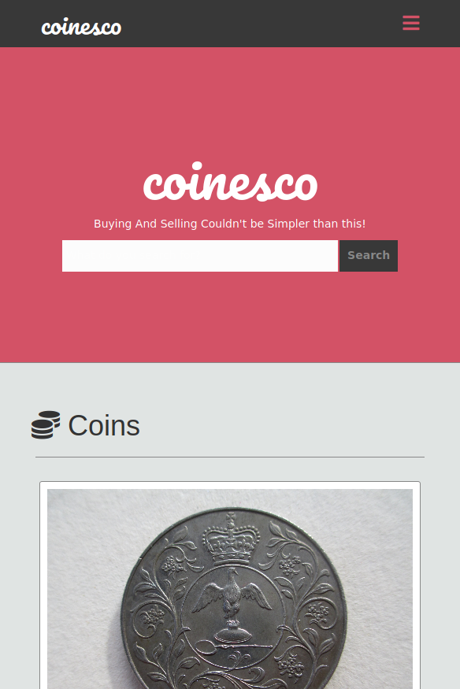

# Capstone Project: HTML and Css

> Final Project of HTML and CSS Module.

> In this final project it was asked to combine all knowledge about semantic HTML tags, box model, industry-standard tools like flexbox to place elements and media queries to make an online shop with responsive design and proper UX.
I had an example design made by Mohammed Awad that I could follow and guide me through the project.

## Built with

- HTML, CSS and Bootstrap

## Live Demo

Live demo [here](https://leandro-barretoo.github.io/html-css-capstone/)

## Authors

:bust_in_silhouette: **Author 1**

- GitHub: [@Leandro-Barretoo](https://github.com/Leandro-Barretoo)
- Twitter: [@Leandro74972596](https://twitter.com/Leandro74972596)
- LinkedIn: [LinkedIn](https://www.linkedin.com/in/leandro-miguel-gon%C3%A7alves-barreto-7079b11ba/)

## :thumbsup: Contributing

1. Fork it (<https://github.com/Leandro-Barretoo/html-css-capstone/fork>)
2. Create your feature branch (`git checkout -b <branch-name>`)
3. Commit your changes (`git commit -m "Descriptive change"`)
4. Push to the branch (`git push -u origin <branch-name>`)
5. Create a new Pull Request

## Show your support

Give a :star: if you like this project!

## Acknowledgments

- Odin's Project Positioning Lessons
- Credit to Mohammed Awad. Check is work at (https://dribbble.com/m_awad).

## :page_with_curl: License

See the license [here](./LICENSE.md)
